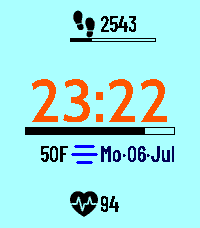
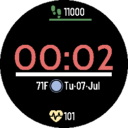

# At A Glance

This is a Pebble watch face inspired by cockpit instrumentation. It displays information with minimal interpretation. Time stays dominant. Icons identify. Numbers quantify. Lines show progress. Color communicates state.

The goal is a display that feels *precise, neutral, obvious, and available at a glance*.

## Adjacent

- [UserInterface](docs/UserInterface.md) for the current visual realization.

## Screenshots

| <center><b>Color rectangular</b></center> | <center><b>Round monochrome</b></center> |
| :---: | :---: |
| <center><b><br>Emery: Clear as Celeste</b></center> | <center><b><br>Gabbro: White on Black</b></center> |

## Installation

- [Pebble App Store: At A Glance](https://apps.repebble.com/7727666da5c84c259b3a70b3)

- To build from source:

```sh
git clone https://github.com/jhatax/at-a-glance.git
cd at-a-glance
```

- If you've built it locally:

```sh
pebble install --phone YOUR_PHONE_IP
```

`YOUR_PHONE_IP` is the Developer Connection Server IP shown by the Pebble mobile app, which must be `192.168.x.x` or `10.x.x.x`.

## Features

- Dominant time in 12H/24H format
- Weather condition and temperature from Open-Meteo
- Date shown beside weather and temperature
- Battery status track with plugged-in bolt
- Steps, progress, and configurable daily goal (if Pebble Health is available)
- Heart rate (if Pebble Health is available)
- Display modes for monochrome and color devices
- Settings page on the connected phone

## Personalization options:

- Time format: 24-hour or 12-hour
- Temperature unit: Fahrenheit or Celsius
- Weather updates: 15, 30, 45, or 60 minutes
- Display mode: platform-appropriate light, dark, and color palettes
- Heart rate sampling: 10, 15, 30, 60, or 120 minutes
- Steps goal: presets from `4,000` to `20,000`, with custom override support from `4,000` to `32,000`

Configuration is powered by Rebble Clay and opens from the Pebble mobile app. Settings are persisted on the watch.

## Supported Platforms

This watch face is compatible with all Pebble smartwatch models.

## Build

Prerequisites:

- [Pebble SDK](https://developer.repebble.com/sdk/)
- Node.js for PebbleKit JS dependencies

Build the PBW:

```sh
npm install
pebble build
```

## Install

Install on an emulator after building:

```sh
# Pebble Time 2, color, 200x228
pebble install --emulator emery

# Pebble 2 Duo, black and white, 144x168
pebble install --emulator flint

# Pebble Time Round, 180x180
pebble install --emulator chalk

# Pebble Round 2, 260x260
pebble install --emulator gabbro
```

To test the config page in an emulator:

```sh
pebble emu-app-config
```

## Read Next

- [BuildandInstall](docs/BuildandInstall.md) for build, install, and editor-tooling details.
- [Contributing](docs/Contributing.md) for the contributor workflow.

The repository includes `qa/` for the harness, `qa/plans/` for named plans, and `qa/qa-runs/` for local validation evidence.

## License

[MIT](LICENSE)
