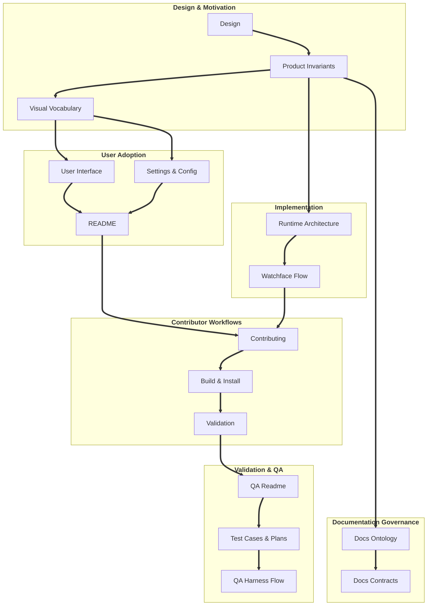

# Documentation Ontology

This ontology indexes the irreducible knowledge domains for the *At A Glance* documentation set.

## Ontology Invariants

1. One first-class concept has one canonical home.
2. The documentation set is complete when its first-class concepts have one clear owner.

Document purpose, sub-concepts, relationships, navigation, and document-addition rules belong in [DocumentationContracts](DocumentationContracts.md).

## Canonical Knowledge Domains

Translation of guardrails: Before placing content, classify the knowledge using these first-class concepts:

| Concept | Canonical Home |
|:---|:---|
| Product entry point | [Watchface_Readme](../README.md) |
| <b>Prescriptive Documents</b> | |
| Product intent | [Design](Design.md) |
| Product invariants | [ProductInvariants](ProductInvariants.md) |
| Visual vocabulary | [VisualVocabulary](VisualVocabulary.md) |
| <b>Implementation & Evidentiary Documents</b> | |
| Watchface implementation flow | [WatchfaceImplementationFlow](WatchfaceImplementationFlow.md) |
| Visual evidence | [UserInterface](UserInterface.md) |
| Runtime architecture | [RuntimeArchitecture](RuntimeArchitecture.md) |
| Settings and configuration | [SettingsandConfiguration](SettingsandConfiguration.md) |
| Contributor workflow | [Contributing](Contributing.md) |
| Build & Install system | [BuildandInstall](BuildandInstall.md) |
| <b>Validation & QA Documents</b> | |
| Validation system | [Validation](Validation.md) |
| QA harness operations | [QA_Readme](../qa/README.md) |
| QA test cases and plans | [WritingTestCasesAndPlans](../qa/docs/WritingTestCasesAndPlans.md) |
| QA implementation flow | [QAHarnessImplementationFlow](../qa/docs/QAHarnessImplementationFlow.md) |
| <b>Governance Documents</b> | |
| Documentation routing | [DocumentationOntology](DocumentationOntology.md) |
| Documentation contracts | [DocumentationContracts](DocumentationContracts.md) |

## Document Relationship Graph

The graph shows the primary conceptual progression through the documentation set. It is not a complete rendering of every document link. Each document's `Adjacent` and `Read Next` sections remain the complete navigation and relationship contract; the graph selects the most meaningful directional connections and omits secondary links to keep the map readable.

## Emergent Properties

The following are not first-class concepts because they carry no unique knowledge:

- Product Identity
- Shared DNA
- Layout
- Display Modes
- Color
- Typography
- Platform Adaptation

They may appear where useful, but they stay embedded in the documents above until one of them needs an independent question, audience, and maintenance surface.
