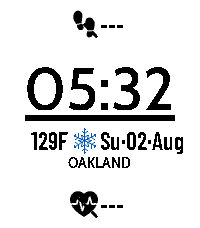
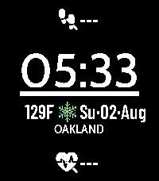
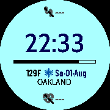
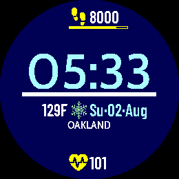
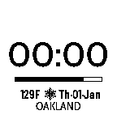
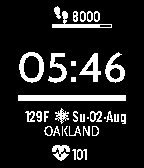
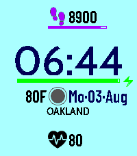
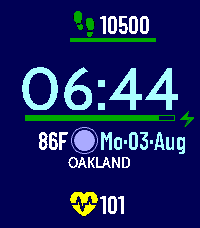
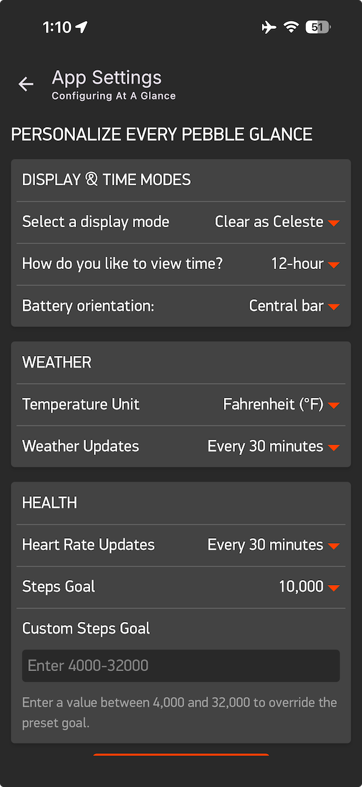

# User Interface

This document records the current UI of _At A Glance_. It is the reference for the implemented stack, geometry, fonts, palettes, icon sizes, glyph realization, and screenshot status.

## Adjacent

- [ProductInvariants](ProductInvariants.md) defines the properties this implementation must satisfy.
- [VisualVocabulary](VisualVocabulary.md) defines the visual rules represented here.

## Visual Evidence

### On Device

Current device screenshots are checked in under `docs/assets/screenshots/`. Together with the coordinates, palettes, typography, and glyph realization tables below, they provide evidence to satisfy the watch face's visual invariants for legibility, placements, and compatibility with all devices.

|                                                                                                                                                        |                                                                                                                                                     |                                                                                                                                                                    |                                                                                                                                                                  |
| :----------------------------------------------------------------------------------------------------------------------------------------------------: | :-------------------------------------------------------------------------------------------------------------------------------------------------: | :----------------------------------------------------------------------------------------------------------------------------------------------------------------: | :--------------------------------------------------------------------------------------------------------------------------------------------------------------: |
|  <b><br>Emery: Black on White</b>   | <b><br>Emery: White on Black</b> |         <b><br>Chalk: Clear as Celeste</b>         |    <b><br>Gabbro: Night in Oxford</b>     |
| <b><br>Aplite: Black on White</b> | <b><br>Flint: White on Black</b> | <b><br>Emery: Clear as Celeste _all_</b> | <b><br>Gabbro: Night in Oxford _all_</b> |

Glyph validation is covered in [Contributing](Contributing.md). It should be treated as a priority when glyphs are modified or new glyphs are introduced.

### Settings

The current Clay settings page is captured here as interface evidence only. The settings contract, defaults, valid ranges, AppMessage keys, PKJS normalization, and persistence rules live in [SettingsandConfiguration](SettingsandConfiguration.md).



## Current Visual Stack

The current stack and information hierarchy is shared across display families and geometries:

```text
top steps context
dominant centered time
centered battery track and plugged-in bolt
weather/date context
centered location
bottom heart-rate context
```

## Current Information Placement

- Platform-specific and integer-based.
- Resolved from defined layout constants for the active platform rather than scaling one master layout across every device.
- Health rows are present only on `PBL_HEALTH` builds.

## Current Coordinates

Coordinates are `x,y,w,h`.

### Emery

- Platform: Pebble Time 2
- Face: `200x228`
- Classification: full

| Element        | Frame           |
| :------------- | :-------------- |
| Steps icon     | `69,10,28,28`   |
| Steps text     | `100,10,56,28`  |
| Steps progress | `69,38,87,4`    |
| Time text      | `4,50,192,60`   |
| Battery track  | `25,115,150,6`  |
| Battery fill   | `26,116,148,4`  |
| Battery bolt   | `178,109,18,18` |
| Climate text   | `4,126,64,28`   |
| Climate icon   | `70,126,28,28`  |
| Date text      | `100,126,99,28` |
| Location text  | `25,152,150,16` |
| BPM icon       | `69,190,28,28`  |
| BPM text       | `100,190,36,28` |

### Gabbro

- Platform: Pebble Round 2
- Face: `260x260`
- Classification: full

| Element        | Frame            |
| :------------- | :--------------- |
| Steps icon     | `99,10,28,28`    |
| Steps text     | `130,10,56,28`   |
| Steps progress | `99,38,87,4`     |
| Time text      | `4,57,252,72`    |
| Battery track  | `32,134,195,6`   |
| Battery fill   | `33,135,193,4`   |
| Battery bolt   | `230,128,18,18`  |
| Climate text   | `4,145,94,28`    |
| Climate icon   | `100,145,28,28`  |
| Date text      | `130,145,129,28` |
| Location text  | `32,171,195,16`  |
| BPM icon       | `99,222,28,28`   |
| BPM text       | `130,222,36,28`  |

### Chalk

- Platform: Pebble Time Round
- Face: `180x180`
- Classification: compact

| Element        | Frame           |
| :------------- | :-------------- |
| Steps icon     | `69,10,18,18`   |
| Steps text     | `90,10,40,18`   |
| Steps progress | `69,28,61,4`    |
| Time text      | `2,43,176,50`   |
| Battery track  | `22,98,135,6`   |
| Battery fill   | `23,99,133,4`   |
| Battery bolt   | `160,92,18,18`  |
| Climate text   | `2,109,66,18`   |
| Climate icon   | `70,109,18,18`  |
| Date text      | `90,109,89,18`  |
| Location text  | `22,125,135,14` |
| BPM icon       | `69,152,18,18`  |
| BPM text       | `90,152,30,18`  |

### Flint

- Platform: Pebble 2 Duo
- Face: `144x168`
- Classification: compact

| Element        | Frame           |
| :------------- | :-------------- |
| Steps icon     | `51,6,18,18`    |
| Steps text     | `72,6,40,18`    |
| Steps progress | `51,24,61,4`    |
| Time text      | `2,40,140,50`   |
| Battery track  | `18,95,108,6`   |
| Battery fill   | `19,96,106,4`   |
| Battery bolt   | `129,89,18,18`  |
| Climate text   | `2,106,48,18`   |
| Climate icon   | `52,106,18,18`  |
| Date text      | `72,106,71,18`  |
| Location text  | `18,122,108,14` |
| BPM icon       | `51,144,18,18`  |
| BPM text       | `72,144,30,18`  |

### Aplite

- Platform: Pebble Classic / Aplite
- Face: `144x168`
- Classification: compact
- Health: not present

| Element       | Frame           |
| :------------ | :-------------- |
| Time text     | `2,40,140,50`   |
| Battery track | `18,95,108,6`   |
| Battery fill  | `19,96,106,4`   |
| Battery bolt  | `129,89,18,18`  |
| Climate text  | `2,106,48,18`   |
| Climate icon  | `52,106,18,18`  |
| Date text     | `72,106,71,18`  |
| Location text | `18,122,108,14` |

### Typography

The `layout_stylist` selects fonts by display class (compact or full) and font role. The `Text` role is shared by climate, BPM, and steps; location has its own font role. System fonts are selected first and replaced by the corresponding custom font when it loads successfully.

Custom fonts: **Cabin** for time and location, **Barlow Condensed** for date and metrics. Font sizes are customized for compact and full displays.

| Role                             | Compact system font                 | Compact custom font                 | Full system font                 | Full custom font                                                                          |
| :------------------------------- | :---------------------------------- | :---------------------------------- | :------------------------------- | :---------------------------------------------------------------------------------------- |
| <b>Time</b>                      | `FONT_KEY_BITHAM_42_MEDIUM_NUMBERS` | `RESOURCE_ID_FONT_CABIN_MEDIUM_42`  | `FONT_KEY_ROBOTO_BOLD_SUBSET_49` | `RESOURCE_ID_FONT_CABIN_MEDIUM_58` (Emery)<br>`RESOURCE_ID_FONT_CABIN_MEDIUM_70` (Gabbro) |
| <b>Date</b>                      | `FONT_KEY_GOTHIC_18_BOLD`           | `RESOURCE_ID_FONT_TEXT_SEMIBOLD_16` | `FONT_KEY_GOTHIC_24_BOLD`        | `RESOURCE_ID_FONT_TEXT_SEMIBOLD_24`                                                       |
| <b>Text (Steps, Temp., etc.)</b> | `FONT_KEY_GOTHIC_18_BOLD`           | `RESOURCE_ID_FONT_TEXT_SEMIBOLD_16` | `FONT_KEY_GOTHIC_24_BOLD`        | `RESOURCE_ID_FONT_TEXT_SEMIBOLD_24`                                                       |
| <b>Location</b>                  | `FONT_KEY_GOTHIC_18_BOLD`           | `RESOURCE_ID_FONT_LOCATION_14`      | `FONT_KEY_GOTHIC_24_BOLD`        | `RESOURCE_ID_FONT_LOCATION_16`                                                            |

- Text metrics, coordinates, height, width, are defined per field.
- Font selection depends on role, display class, and platform.

## Supported Display Modes

- On color-capable watches, four modes are available.
- On monochrome-capable watches, two monochrome-specific modes are available.
- Each mode uses a defined palette to render text, icons, and convey state.
- Click the Back button three times to cycle display modes.
- The watch repaints immediately when the mode changes.

This satisfies the invariant that choices are available on all devices.

### Display Mode Palette Characteristics

The combined palette for each mode satisfies the design invariant of perceptual fluency. Colors within each palette are mutually exclusive to satisfy, "one visual channel, one responsibility", visual invariant.

There are five sub-palettes that harmonize together to maximize contrast and convey state.

1. Primary Display
2. Module: Battery
3. Module: BPM
4. Module: Climate
5. Module: Steps

### Realization of Shared Visual Identity

1. On Monochrome hardware, light and dark palettes are mirror images of one another.
2. Palette pairs ({mono-light, mono-dark}, {color-light, color-dark}) have {time+date text, background} in one swapped with their opposite metric in the other.
3. Module displays define `normal` and `unknown` that mirror values from the active primary display palette.

### Consolidated Color Palettes for Display Modes

**Source of truth**: Current palette code in `layout_stylist.c`, `climate.c`, `bpm.c`, `steps.c`, `battery.c`.

**Columns**

- Color's primary role
- `Mono-Light BW`: `DISPLAY_MODE_LIGHT_MONOCHROME` (on monochrome)
- `Mono-Dark BW`: `DISPLAY_MODE_DARK_MONOCHROME` (on monochrome)
- `Mono-Light C`: `DISPLAY_MODE_LIGHT_MONOCHROME` (on color)
- `Mono-Dark C`: `DISPLAY_MODE_DARK_MONOCHROME` (on color)
- `Clear as Celeste`: `DISPLAY_MODE_LIGHT_COLOR` (on color)
- `Night in Oxford`: `DISPLAY_MODE_DARK_COLOR` (on color)

| Color role                   |  Mono-Light BW   |   Mono-Dark BW    |    Mono-Light C     |     Mono-Dark C      |  Clear as Celeste   |   Night in Oxford    |
| :--------------------------- | :--------------: | :---------------: | :-----------------: | :------------------: | :-----------------: | :------------------: |
| **PRIMARY**                  |                  |                   |                     |                      |                     |                      |
| Background                   |  `GColorWhite`   |   `GColorBlack`   |    `GColorWhite`    |    `GColorBlack`     |   `GColorCeleste`   |  `GColorOxfordBlue`  |
| Primary text                 |  `GColorBlack`   |   `GColorWhite`   |    `GColorBlack`    |    `GColorWhite`     |    `GColorBlack`    |    `GColorWhite`     |
| Out-of-Range text            |  `GColorBlack`   |   `GColorWhite`   |    `GColorBlack`    |    `GColorWhite`     |  `GColorDarkGray`   |  `GColorLightGray`   |
| Date                         |  `GColorBlack`   |   `GColorWhite`   |    `GColorBlack`    |    `GColorWhite`     | `GColorOxfordBlue`  |   `GColorCeleste`    |
| Time                         |  `GColorBlack`   |   `GColorWhite`   |    `GColorBlack`    |    `GColorWhite`     | `GColorOxfordBlue`  |   `GColorCeleste`    |
| **BATTERY**                  |                  |                   |                     |                      |                     |                      |
| Background                   |  `GColorWhite`   |   `GColorBlack`   |    `GColorWhite`    |    `GColorBlack`     |   `GColorCeleste`   |  `GColorOxfordBlue`  |
| Normal (`>50`)               |  `GColorBlack`   |   `GColorWhite`   |    `GColorBlack`    |    `GColorWhite`     |    `GColorBlack`    |    `GColorWhite`     |
| Medium (`21-50`)             |  `GColorBlack`   |   `GColorWhite`   | `GColorVividViolet` |   `GColorIcterine`   | `GColorVividViolet` |   `GColorIcterine`   |
| Critical (`<=20`)            |  `GColorBlack`   |   `GColorWhite`   |     `GColorRed`     |     `GColorRed`      |     `GColorRed`     |     `GColorRed`      |
| Plugged In                   |  `GColorBlack`   |   `GColorWhite`   | `GColorJaegerGreen` | `GColorIslamicGreen` | `GColorJaegerGreen` | `GColorIslamicGreen` |
| **STEPS**                    |                  |                   |                     |                      |                     |                      |
| Background                   |  `GColorWhite`   |   `GColorBlack`   |    `GColorWhite`    |    `GColorBlack`     |   `GColorCeleste`   |  `GColorOxfordBlue`  |
| Normal                       |  `GColorBlack`   |   `GColorWhite`   |    `GColorBlack`    |    `GColorWhite`     |    `GColorBlack`    |    `GColorWhite`     |
| Out-of-Range                 |  `GColorBlack`   |   `GColorWhite`   |    `GColorBlack`    |    `GColorWhite`     |  `GColorDarkGray`   |  `GColorLightGray`   |
| Approaching (`>70%` of goal) |  `GColorBlack`   |   `GColorWhite`   | `GColorVividViolet` |   `GColorIcterine`   | `GColorVividViolet` |   `GColorIcterine`   |
| Achieved (`>= goal`)         |  `GColorBlack`   |   `GColorWhite`   | `GColorJaegerGreen` | `GColorIslamicGreen` | `GColorJaegerGreen` | `GColorIslamicGreen` |
| **CLIMATE**                  |                  |                   |                     |                      |                     |                      |
| Background                   |  `GColorWhite`   |   `GColorBlack`   |    `GColorWhite`    |    `GColorBlack`     |   `GColorCeleste`   |  `GColorOxfordBlue`  |
| Normal                       |  `GColorBlack`   |   `GColorWhite`   |    `GColorBlack`    |    `GColorWhite`     |    `GColorBlack`    |    `GColorWhite`     |
| Out-of-Range                 |  `GColorBlack`   |   `GColorWhite`   |    `GColorBlack`    |    `GColorWhite`     |  `GColorDarkGray`   |  `GColorLightGray`   |
| Sun                          |  `GColorBlack`   |   `GColorWhite`   | `GColorWindsorTan`  | `GColorChromeYellow` | `GColorWindsorTan`  | `GColorChromeYellow` |
| Cold                         |  `GColorBlack`   |   `GColorWhite`   | `GColorCobaltBlue`  |  `GColorMintGreen`   | `GColorCobaltBlue`  |  `GColorMintGreen`   |
| Cloud                        |  `GColorBlack`   |   `GColorWhite`   |    `GColorBlue`     | `GColorElectricBlue` |    `GColorBlue`     | `GColorElectricBlue` |
| Clear Ring (night)           | `GColorDarkGray` |   `GColorWhite`   |  `GColorDarkGray`   | `GColorBabyBlueEyes` |  `GColorDarkGray`   | `GColorBabyBlueEyes` |
| Clear Fill                   | `GColorDarkGray` | `GColorLightGray` |  `GColorDarkGray`   | `GColorBabyBlueEyes` |  `GColorDarkGray`   | `GColorBabyBlueEyes` |
| **Heart-rate**               |                  |                   |                     |                      |                     |                      |
| Background                   |  `GColorWhite`   |   `GColorBlack`   |    `GColorWhite`    |    `GColorBlack`     |   `GColorCeleste`   |  `GColorOxfordBlue`  |
| Normal                       |  `GColorBlack`   |   `GColorWhite`   |    `GColorBlack`    |    `GColorWhite`     |    `GColorBlack`    |    `GColorWhite`     |
| Out-of-Range                 |  `GColorBlack`   |   `GColorWhite`   |    `GColorBlack`    |    `GColorWhite`     |  `GColorDarkGray`   |  `GColorLightGray`   |
| Elevated (`>=100`)           |  `GColorBlack`   |   `GColorWhite`   | `GColorVividViolet` |   `GColorIcterine`   | `GColorVividViolet` |   `GColorIcterine`   |
| Critical (`>=120`)           |  `GColorBlack`   |   `GColorWhite`   |     `GColorRed`     |     `GColorRed`      |     `GColorRed`     |     `GColorRed`      |

## Current Icon Sizes

- **Compact** icon size: `18x18`
- **Full** icon size: `28x28`

## Current Glyph Realization

The current glyph system uses familiar heart-and-waveform, weather, walking, battery, and power marks that read at watch scale.

### Health Glyphs

- Steps use a walking bitmap asset.
- BPM uses an ECG bitmap asset.
- Walking and ECG bitmap foreground pixels are recolored from the metric's live state color.
- Health text uses normal text color when available and out-of-range text color when unavailable.
- Out-of-range steps and BPM draw the shared absence slash over the icon.

### Battery Glyphs

- Battery uses a horizontal track to convey charge level.
- The track outline and fill use the live battery state color.
- The fill width is proportional to charge percentage.
- A filled bolt appears only when the watch is plugged in.
- On color displays, plugged-in state also shifts the battery color to the plugged-in palette color.

### Climate Glyphs

Climate glyphs are procedural and drawn in the climate icon frame. The current procedural glyph reference grid is `28x28`. Weather condition codes are grouped into the current icon families:

| Weather code range | Current icon family |
| ------------------ | ------------------- |
| `<0` or `>99`      | Out-of-range        |
| `0-1`              | Clear               |
| `2`                | Partly cloudy       |
| `3`                | Cloud               |
| `4-48`             | Fog                 |
| `49-55`            | Drizzle             |
| `56-57`            | Sleet drizzle       |
| `58-63`            | Rain                |
| `64-65`            | Heavy rain          |
| `66-67`            | Heavy sleet         |
| `68-77`            | Snow                |
| `78-81`            | Showers             |
| `82`               | Heavy showers       |
| `83-86`            | Snow showers        |
| `87-99`            | Thunderstorm        |

**Current climate glyph realization**

- Day clear weather uses a sun glyph.
- Night clear weather uses a filled/ringed clear glyph.
- Partly cloudy draws a reduced clear glyph behind a cloud.
- Cloud uses three lobes plus a shared body fill so the silhouette reads as one cloud.
- Fog uses three horizontal bars.
- Drizzle uses three heavier staggered marks.
- Rain uses slanted rain marks; heavy rain uses longer marks.
- Snow uses a procedural snowflake with six spokes, chevrons, and a center dot.
- Sleet combines cloud, snowflake, and rain marks.
- Showers combine a cloud with rain marks while keeping precipitation separate from the cloud baseline.
- Snow showers combine a cloud with a snowflake while keeping precipitation visually separate from the cloud shape.
- Thunderstorm uses the shared filled bolt primitive.
- Out-of-range weather draws a cloud with the shared absence slash.

### Out-of-range Visual Identification: Left-to-Right Diagonal Slash

Out-of-range metric and weather states use a shared diagonal slash. The slash is drawn from the 28x28 design-space diagonal with three line segments and a 2px stroke, then scaled to the active icon frame.

## Read Next

- [WatchfaceImplementationFlow](WatchfaceImplementationFlow.md) for implementation flow, source responsibilities, and interconnections.
- [SettingsandConfiguration](SettingsandConfiguration.md) for the settings catalog.
- [Validation](Validation.md) for validation contract, scenarios, and visual review evidence.
